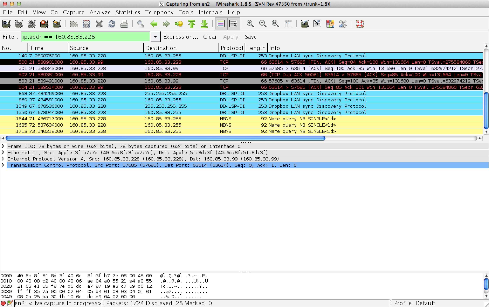

Praktikum 1
===========
#Team
* Adrian Bertschi
* Pascal Helfenstein

#Fehlersemantik
## Aufgabe 1

Wie merkt ein Client, wenn die aufgerufene Methode während der Auftragsbearbeitung abstürzt oder aber in eine ewige Schleife gerät?

###Endlossschlaufe

####Testversuch
* Eingabe: `Endless`
* Ausgabe: Keine, der Client bleibt hängen

Client merkt es gar nicht. Wenn der Server beendet, merkt es der Client.

Beim beenden des Servers tritt folgende Exception auf:

	java.rmi.UnmarshalException: Error unmarshaling return header; nested exception is: 
		java.io.EOFException
		at sun.rmi.transport.StreamRemoteCall.executeCall(StreamRemoteCall.java:228)
		at sun.rmi.server.UnicastRef.invoke(UnicastRef.java:161)
		at java.rmi.server.RemoteObjectInvocationHandler.invokeRemoteMethod(RemoteObjectInvocationHandler.java:194)
		at java.rmi.server.RemoteObjectInvocationHandler.invoke(RemoteObjectInvocationHandler.java:148)
		at com.sun.proxy.$Proxy0.interpret(Unknown Source)
		at ch.zhaw.client.GuiBox.interpret(GuiBox.java:116)
		at ch.zhaw.client.GuiBox.interpret(GuiBox.java:124)
		at ch.zhaw.client.GuiBox.actionPerformed(GuiBox.java:134)
		at java.awt.TextField.processActionEvent(TextField.java:617)
		at java.awt.TextField.processEvent(TextField.java:585)
		at java.awt.Component.dispatchEventImpl(Component.java:4861)
		at java.awt.Component.dispatchEvent(Component.java:4687)
		at java.awt.EventQueue.dispatchEventImpl(EventQueue.java:735)
		at java.awt.EventQueue.access$200(EventQueue.java:103)
		at java.awt.EventQueue$3.run(EventQueue.java:694)
		at java.awt.EventQueue$3.run(EventQueue.java:692)
		at java.security.AccessController.doPrivileged(Native Method)
		at java.security.ProtectionDomain$1.doIntersectionPrivilege(ProtectionDomain.java:76)
		at java.security.ProtectionDomain$1.doIntersectionPrivilege(ProtectionDomain.java:87)
		at java.awt.EventQueue$4.run(EventQueue.java:708)
		at java.awt.EventQueue$4.run(EventQueue.java:706)
		at java.security.AccessController.doPrivileged(Native Method)
		at java.security.ProtectionDomain$1.doIntersectionPrivilege(ProtectionDomain.java:76)
		at java.awt.EventQueue.dispatchEvent(EventQueue.java:705)
		at java.awt.EventDispatchThread.pumpOneEventForFilters(EventDispatchThread.java:242)
		at java.awt.EventDispatchThread.pumpEventsForFilter(EventDispatchThread.java:161)
		at java.awt.EventDispatchThread.pumpEventsForHierarchy(EventDispatchThread.java:150)
		at java.awt.EventDispatchThread.pumpEvents(EventDispatchThread.java:146)
		at java.awt.EventDispatchThread.pumpEvents(EventDispatchThread.java:138)
		at java.awt.EventDispatchThread.run(EventDispatchThread.java:91)
	Caused by: java.io.EOFException
		at java.io.DataInputStream.readByte(DataInputStream.java:267)
		at sun.rmi.transport.StreamRemoteCall.executeCall(StreamRemoteCall.java:214)
		... 29 more

###Exception

####Testversuch
* Eingabe: `Exception`
* Ausgabe: Remote Exception

Tritt eine Exception auf, wird diese weitergeleitet
	
	Exception in thread "AWT-EventQueue-0" java.lang.ArithmeticException: / by zero
		at ch.zhaw.server.EchoRmiServer.interpret(EchoRmiServer.java:28)
		at sun.reflect.NativeMethodAccessorImpl.invoke0(Native Method)
		at sun.reflect.NativeMethodAccessorImpl.invoke(NativeMethodAccessorImpl.java:57)
		at sun.reflect.DelegatingMethodAccessorImpl.invoke(DelegatingMethodAccessorImpl.java:43)
		at java.lang.reflect.Method.invoke(Method.java:601)
		at sun.rmi.server.UnicastServerRef.dispatch(UnicastServerRef.java:322)
		at sun.rmi.transport.Transport$1.run(Transport.java:177)
		at sun.rmi.transport.Transport$1.run(Transport.java:174)
		at java.security.AccessController.doPrivileged(Native Method)
		at sun.rmi.transport.Transport.serviceCall(Transport.java:173)
		at sun.rmi.transport.tcp.TCPTransport.handleMessages(TCPTransport.java:553)
		at sun.rmi.transport.tcp.TCPTransport$ConnectionHandler.run0(TCPTransport.java:808)
		at sun.rmi.transport.tcp.TCPTransport$ConnectionHandler.run(TCPTransport.java:667)
		at java.util.concurrent.ThreadPoolExecutor.runWorker(ThreadPoolExecutor.java:1145)
		at java.util.concurrent.ThreadPoolExecutor$Worker.run(ThreadPoolExecutor.java:615)
		at java.lang.Thread.run(Thread.java:722)
		at sun.rmi.transport.StreamRemoteCall.exceptionReceivedFromServer(StreamRemoteCall.java:275)
		at sun.rmi.transport.StreamRemoteCall.executeCall(StreamRemoteCall.java:252)
		at sun.rmi.server.UnicastRef.invoke(UnicastRef.java:161)
		at java.rmi.server.RemoteObjectInvocationHandler.invokeRemoteMethod(RemoteObjectInvocationHandler.java:194)
		at java.rmi.server.RemoteObjectInvocationHandler.invoke(RemoteObjectInvocationHandler.java:148)
		at com.sun.proxy.$Proxy0.interpret(Unknown Source)
		at ch.zhaw.client.GuiBox.interpret(GuiBox.java:116)
		at ch.zhaw.client.GuiBox.actionPerformed(GuiBox.java:134)
		at java.awt.Button.processActionEvent(Button.java:409)
		at java.awt.Button.processEvent(Button.java:377)
		at java.awt.Component.dispatchEventImpl(Component.java:4861)
		at java.awt.Component.dispatchEvent(Component.java:4687)
		at java.awt.EventQueue.dispatchEventImpl(EventQueue.java:735)
		at java.awt.EventQueue.access$200(EventQueue.java:103)
		at java.awt.EventQueue$3.run(EventQueue.java:694)
		at java.awt.EventQueue$3.run(EventQueue.java:692)
		at java.security.AccessController.doPrivileged(Native Method)
		at java.security.ProtectionDomain$1.doIntersectionPrivilege(ProtectionDomain.java:76)
		at java.security.ProtectionDomain$1.doIntersectionPrivilege(ProtectionDomain.java:87)
		at java.awt.EventQueue$4.run(EventQueue.java:708)
		at java.awt.EventQueue$4.run(EventQueue.java:706)
		at java.security.AccessController.doPrivileged(Native Method)
		at java.security.ProtectionDomain$1.doIntersectionPrivilege(ProtectionDomain.java:76)
		at java.awt.EventQueue.dispatchEvent(EventQueue.java:705)
		at java.awt.EventDispatchThread.pumpOneEventForFilters(EventDispatchThread.java:242)
		at java.awt.EventDispatchThread.pumpEventsForFilter(EventDispatchThread.java:161)
		at java.awt.EventDispatchThread.pumpEventsForHierarchy(EventDispatchThread.java:150)
		at java.awt.EventDispatchThread.pumpEvents(EventDispatchThread.java:146)
		at java.awt.EventDispatchThread.pumpEvents(EventDispatchThread.java:138)
		at java.awt.EventDispatchThread.run(EventDispatchThread.java:91)

##Aufgabe 2

Ist die Methode, sollte der Server (Server-Objekt bzw. Plattform) trotzdem unversehrt weiterlaufen, erneut ansprechbar?

###Endlosschlaufe
Der Server kann weiterhin von anderen Clients ganz normal angesprochen werden.

###Exception
Dei vom Server geworfene Exception wird auf dem Client gefangen, es kann weiter gearbeitet werden.


##Aufgabe 3
Inwiefern geraten sich verschiedene Clients, welche "gleichzeitig" einen RMI-Aufruf plazieren, einander in die Quere?

####Testversuch
* Eingabe: `Threading`
* Ausgabe: 16 / 17

Pro Connection gibt es einen eigenen Thread. Bei Zugriffen auf gleiche Ressourcen sollte deshalb Synchronized verwendet werden. 

##Aufgabe 4

Was ist die Rolle der rmiregistry? In welcher Weise sind Server und Client darauf angewiesen?

Die rmiregistry implementiert den Portmapper von RPC. Der Server trägt sich bei der registry auf dem Localhost ein mit seinem namen. Dies geschieht beim Bind aufruf.

Der Client greift beim lookup call auf den Server mit dem RMI Standardport auf die registry zu und fragt nach dem Port des Servers mit dem entsprechenden Namen. Danach kommunizieren sie über einen Highlevelport, hier z.B. `63614`



#Performance
Was kostet ein RMI-Zyklus? Welche Faktoren bestimmen in welchem Mass die verschiedenen Zeitintervalle, die ein kompletter RMI-Call beansprucht? Gibt es Timeout-Werte, und wie machen sich allfällige Timeout-Ereignisse bemerkbar? 
Dokumentieren Sie Ihre Versuchsanordnung, die damit gewonnen Messwerte, und stellen Sie die Resultate verständlich und plausibel dar.

##Versuch
Unser Testcode macht einen RMI Aufruf und misst die Zeit, instanziert den RMI Server als Objekt und ruft interpret ohne RMI auf, also direkt auf dem Objekt auf. Den gleichen Versuch machen wir noch auf 2 Computern welche bei per Lan mit dem ZHAW Lan verbunden sind.

Aufruf | RMI | RMI über Netzwerk |  Lokales Objekt | 
------------ | ------------- | ------------
Aufruf 1 | 13ms | 18ms  | 11ms
Aufruf 2 | 1ms | 3ms  | 0ms

#Netzwerkunterbrüche

Was geschieht wenn während der Ausführung die Netwerkverbindung unterbricht? Was wenn sie zwischen der Ausführung Unterbricht und wieder aufgebaut werden kann?

####Testversuch mit Server Kabel ausstecken
* Eingabe: `Wait60`
* Kabel ausgesteckt
* Kabel eingesteckt
* Ausgabe: waited for 60 seconds

Wenn während der Ausführung des Befehls, hier beispielsweise eine While Schlaufe die 60 Sekunden dauert, die Netzwerkverbindung des Servers unterbrochen wird und rechtzeitig wiederhergestellt ist, erhält der Client die Response als ob nichts passiert wäre.

####Testversuch mit Client Kabel ausstecken
* Eingabe: `Wait60`
* Kabel ausgesteckt
* Kabel eingesteckt
* Ausgabe: waited for 60 seconds

Der Versuch liefert das selbe Resultat wie auch beim Austecken des Kabels beim Server. Der Response wird ganz normal übertragen, als ob nichts passiert wäre.

####Testversuch mit Client Kabel nicht rechtzeitig wieder eingesteckt
* Eingabe: `Wait20`
* Kabel ausgesteckt
* Warten für 30 Sekunden
* Kabel eingesteckt
* Ausgabe: waited for 20 seconds

Es funktioniert auch hier, als ob nichts geschehen wäre. Sobald der Computer wieder mit dem RMI Server kommunizieren kann, erhält er den Response.

####Testversuch mit Client Kabel nicht rechtzeitig wieder eingesteckt, 60 Sekunden
* Eingabe: `Wait60`
* Kabel ausgesteckt
* Warten für 70 Sekunden
* Kabel eingesteckt
* Ausgabe: waited for 60 seconds / hängende GuiBox

Es funktionierte bei einem von zwei Versuchen. Beim einen Versuch wurde die Ausgabe korrekt gemacht, beim anderen Versuch hängte die GUIBox.