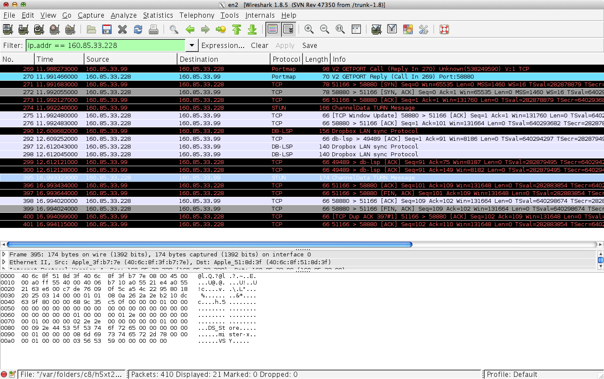

Praktikum 2
===========

#Team
* Adrian Bertschi
* Pascal Helfenstein

#Aufgabe remotels

###Wie verhält sich RPC, wenn mehrer Clients gleichzeitig auf den Server zugreifen? 
<!-- Um den Effekt zu sehen, verlangsamen Sie den Server durch den Einbau der Funktion sleep (einbinden mit #include <unistd.h> )-->

Die Anfragen werden Seriel abgearbeitet, nicht parallel. Ab ~ 40 Sekunden meldet der Client einen Timeout fehler:

	call failed: RPC: Timed out

Bei mehreren Clients addiert sich die Laufzeit der Prozedur, dadurch tritt der Timeout schneller ein.
 

###Läuft die Kommunikation über UDP oder TCP? Wie können Sie das ändern?

Die Kommunikation läuft über UDP Sofern es nicht anderst eingestellt wurde.

	clnt = clnt_create(host, DIRPROG, DIRVERS, "udp");

Um es zu ändern, setzten wir einfach den 4. Parameter auf `tcp`

	clnt = clnt_create(host, DIRPROG, DIRVERS, "tcp");

In Wireshark ändert sich dadurch das Protokoll von `RPC` zu `STUN` und bei der analyse des Frame Inhalts sind TCP Pakete erkennbar.

